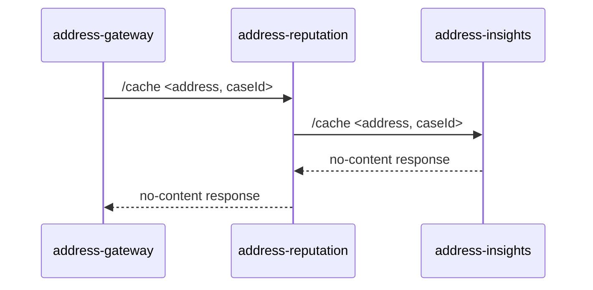

# address-gateway

`address-gateway` provides api-platform access to `address-lookup` and `address-reputation` services.

`address-lookup`

`address-reputation/cache`

`address-reputation/reputation/sa-reg`

### License

This code is open source software licensed under the [Apache 2.0 License]("http://www.apache.org/licenses/LICENSE-2.0.html").
